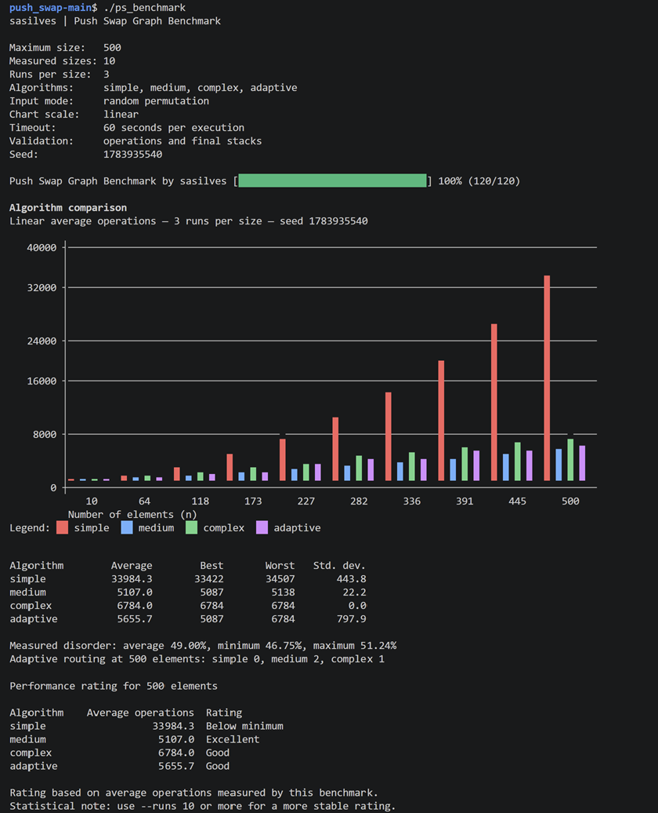

# Push Swap Graph Benchmark

*A portable terminal benchmark created by **sasilves** for multi-strategy
`push_swap` implementations.*

It compares `--simple`, `--medium`, `--complex`, and `--adaptive`, validates the
operations produced by `push_swap`, and displays the results as a graph.

## Quick start

Copy your compiled `push_swap` executable into the benchmark directory:

```text
Push-Swap-Graph-Benchmark/
├── push_swap
├── push_swap_benchmark.c
├── Makefile
└── README.md
```

For example:

```bash
cp /path/to/your/push_swap ./push_swap
```

Compile the benchmark:

```bash
make
```

Run it:

```bash
./ps_benchmark
```

That is all that is required. You do not need Python, an external checker, or
changes to the source code or Makefile of your own `push_swap` project.

To remove the compiled benchmark:

```bash
make clean
```

To compile it again from scratch:

```bash
make re
```

You can also compile it without the Makefile:

```bash
cc -Wall -Wextra -Werror push_swap_benchmark.c -lm -o ps_benchmark
```

## Common examples

Run the default benchmark:

```bash
./ps_benchmark
```

Compare every strategy up to 500 elements:

```bash
./ps_benchmark --max 500 --algorithms all --runs 10 --seed 42
```

Compare selected strategies:

```bash
./ps_benchmark --algorithms medium,complex,adaptive
```

Show every available option:

```bash
./ps_benchmark --help
```

## Preview



## Requirements

The tested program must:

- be available as `./push_swap`;
- accept `--simple`, `--medium`, `--complex`, and `--adaptive`;
- accept the numbers as separate command-line arguments;
- print only valid `push_swap` operations, one per line;
- exit with status `0` after a valid execution.

Example:

```bash
./push_swap --medium 4 1 3 0 2
```

The benchmark is intended for Linux, macOS, WSL, and other POSIX-compatible systems.

## More examples

Use more runs for a more stable average:

```bash
./ps_benchmark --max 500 --samples 10 --runs 10 --seed 42
```

Test a fixed disorder level:

```bash
./ps_benchmark \
    --max 500 \
    --algorithms medium,complex,adaptive \
    --disorder 30 \
    --runs 10 \
    --seed 42
```

Use a logarithmic graph when the operation counts differ greatly:

```bash
./ps_benchmark --log
```

## Options

| Short | Long | Default | Description |
|---|---|---:|---|
| `-m` | `--max` | `500` | Maximum input size, from 2 to 50000. |
| `-p` | `--samples` | `10` | Number of input sizes represented in the graph. |
| `-r` | `--runs` | `3` | Runs performed for each size. |
| `-a` | `--algorithms` | `all` | Strategies to compare. |
| `-d` | `--disorder` | random | Target disorder percentage, from 0 to 100. |
| `-l` | `--log` | disabled | Use a logarithmic vertical scale. |
| `-H` | `--height` | `18` | Graph height, from 8 to 40 rows. |
| `-t` | `--timeout` | `60` | Maximum seconds allowed per execution. |
| `-s` | `--seed` | current time | Seed used to reproduce generated inputs. |
| `-h` | `--help` | — | Display the help message. |

Algorithms are provided as a comma-separated list:

```bash
./ps_benchmark --algorithms simple,medium
```

Valid names:

```text
simple,medium,complex,adaptive,all
```

## How the benchmark works

For every input size and run, the benchmark:

1. Generates one permutation.
2. Sends the same permutation to every selected algorithm.
3. Executes `./push_swap` in an independent child process.
4. Captures and counts its operations.
5. Applies the operations to internal stacks.
6. Verifies that stack A is sorted and stack B is empty.
7. Stores the result and calculates statistics.
8. Draws the comparison graph in the terminal.

Using the same input for every algorithm is essential. It prevents one strategy from receiving an easier permutation than another during the same run.

The benchmark measures the **number of operations**, not execution time.

## Input generation

### Random mode

Without `--disorder`, the benchmark creates random permutations.

```bash
./ps_benchmark --seed 42
```

A custom `xorshift32` generator is used so that the same seed produces the same input sequence across supported systems.

### Controlled disorder

The `--disorder` option creates inputs with a target percentage of inverted pairs:

```bash
./ps_benchmark --disorder 20
./ps_benchmark --disorder 50
./ps_benchmark --disorder 100
```

Disorder is calculated as:

```text
inverted pairs / total possible pairs × 100
```

This gives the following reference points:

- `0%`: sorted input;
- approximately `50%`: highly mixed input;
- `100%`: reverse-sorted input.

For small lists, not every percentage can be represented exactly. The benchmark uses the closest possible number of inversions and reports the actual measured disorder.

The controlled generator uses randomized inversion sequences instead of always taking the lowest or highest remaining value. This produces more varied inputs while preserving the requested inversion count.

## Output validation

The benchmark does not trust the operation count alone.

It recognizes and simulates all 11 valid operations:

```text
sa sb ss
pa pb
ra rb rr
rra rrb rrr
```

An execution is accepted only when:

- every line contains a valid operation;
- the child process exits normally;
- stack A finishes in ascending order;
- stack B finishes empty.

Invalid output, an incorrect final state, a timeout, or an excessive operation count stops the benchmark with an error.

This internal validation removes the need for an external `checker` executable.

## Statistics

For every size and algorithm, the benchmark reports:

- average operations;
- best result;
- worst result;
- standard deviation;
- measured disorder range.

The average is used for the graph, while the other values show how consistent the algorithm is across different permutations.

A low standard deviation indicates stable behavior. A large difference between the best and worst results suggests that performance depends strongly on the input arrangement.

## Graph scales

The default graph uses a linear vertical scale:

```bash
./ps_benchmark
```

Use logarithmic mode when comparing algorithms with very different operation counts:

```bash
./ps_benchmark --log
```

This is particularly useful when `simple` is included, because its quadratic behavior can otherwise compress the curves of the other strategies.

The logarithmic graph changes only the visualization. It does not change the measured values.

## Performance ratings

A rating is shown only when the maximum input size is exactly 100 or 500.

### 100 elements

| Average operations | Rating |
|---:|---|
| Fewer than 700 | Excellent |
| Fewer than 1500 | Good |
| Fewer than 2000 | Minimum pass |
| 2000 or more | Below minimum |

### 500 elements

| Average operations | Rating |
|---:|---|
| Fewer than 5500 | Excellent |
| Fewer than 8000 | Good |
| Fewer than 12000 | Minimum pass |
| 12000 or more | Below minimum |

The rating is based on the benchmark average. It is a performance reference, not a replacement for an official project evaluation.

When controlled disorder is used, the benchmark warns that these thresholds are normally intended for random inputs.

## Adaptive strategy

The benchmark also reports how many times `--adaptive` selected each internal strategy:

```text
simple
medium
complex
```

This helps evaluate whether the adaptive thresholds route inputs as expected instead of treating adaptive as an entirely separate sorting algorithm.

## Safety conditions

The benchmark includes protections against accidental heavy executions:

- maximum input size of 50000;
- maximum number of samples and runs;
- combined workload validation;
- stricter limits for the quadratic `simple` strategy;
- timeout for each child process;
- maximum accepted operation count;
- termination of blocked or excessively long processes;
- cleanup of the active child process group when the benchmark is interrupted;
- validation that `./push_swap` exists and is executable.

Large values remain expensive even when permitted. Start with 100 or 500 elements before testing larger inputs.

## Important interpretation notes

- More runs produce a more reliable average.
- Use the same seed when comparing code changes.
- Random and controlled-disorder tests answer different questions.
- A lower operation count is useful only when the output is valid.
- The graph shows empirical results, not a formal proof of complexity.
- Radix-based algorithms can produce similar counts for every permutation of the same size.
- The selected sample sizes are representative points, not every integer between 2 and `--max`.

## Repository structure

```text
Push-Swap-Graph-Benchmark/
├── Makefile
├── README.md
├── benchmark-preview.png
└── push_swap_benchmark.c
```

## Author

Developed by **sasilves**.
